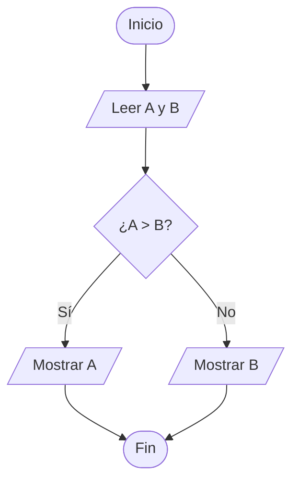

# Algoritmos I

## ¿Qué es un algoritmo?

Un algoritmo es la forma de expresar la resolución de un problema en la fase previa a la codificación.

**Proceso de desarrollo:**

1. Especificación del problema
2. Diseño del algoritmo
3. Codificación del programa
4. Pruebas y validación

---

## Tipos de algoritmos

Existen diferentes formas de representar algoritmos:

- **Diagramas de flujo**: Representación gráfica del proceso
- **Pseudocódigo**: Descripción en lenguaje natural estructurado

---

## Diagramas de flujo

Los diagramas de flujo expresan el diseño del programa de forma gráfica. Permiten representar el problema a diferentes niveles de refinamiento o detalle, desde bloques generales hasta instrucciones específicas.

### Símbolos básicos

| Símbolo | Descripción | Representación |
|---------|-------------|----------------|
| **Inicio/Fin** | Indica el inicio o fin del algoritmo | Óvalo |
| **Proceso** | Representa una operación o instrucción | Rectángulo |
| **Decisión** | Evalúa una condición (verdadero/falso) | Rombo |
| **Entrada/Salida** | Lectura de datos o escritura de resultados | Paralelogramo |
| **Conector** | Conecta diferentes partes del diagrama | Círculo |
| **Flujo** | Indica la dirección del flujo de ejecución | Flecha |


### Ejemplo: Verificar si un número es positivo


### Reglas de construcción

- Desarrollar siempre de arriba abajo y de izquierda a derecha
- En símbolos de decisión: salida por la derecha cuando se cumple, por la izquierda cuando no
- Toda línea de ejecución debe tener una salida o solución
- Seguir estas convenciones facilita la comprensión universal de los diagramas

---

## Pseudocódigo

El pseudocódigo es la expresión escrita en lenguaje natural de un algoritmo, siguiendo una estructura similar a la de un lenguaje de programación.

### Ejemplo 1: Calcular el área de un triángulo

**Diagrama de flujo:**


**Pseudocódigo:**

```text
Inicio
    Leer base
    Leer altura
    area = base * altura / 2
    Escribir area
Fin
```

### Ejemplo 2: Bucle de conteo

**Pseudocódigo:**

```text
Inicio
    x = 0
    Mientras x <= 10 hacer
        Escribir x
        x = x + 1
    FinMientras
Fin
```

**Diagrama de flujo:**


---

# Algoritmos II

## Estructuras básicas

Cualquier programa se puede resolver utilizando una o varias de las estructuras básicas:

- **Secuenciales**
- **Alternativas**
- **Repetitivas**

---

## Estructura secuencial

- La ejecución tiene un comienzo y un final
- Las instrucciones se ejecutan en el mismo orden en el que están escritas
- Puede haber una o muchas instrucciones desde que se inicia la ejecución hasta su final

### Ejemplo: Cálculo del área y longitud de una circunferencia


---

## Estructura alternativa

Permite tomar decisiones según el cumplimiento de condiciones:

- Pueden tener **una o dos salidas** (`if...then...else`)
- Pueden tener **varias salidas** (`switch...case`)
- Pueden contener **otras estructuras anidadas**

### Ejemplo simple: Comparar dos números



### Alternativas anidadas

Las instrucciones alternativas pueden estar **anidadas** unas dentro de otras, permitiendo evaluar múltiples condiciones en secuencia.

!!! note "Anidamiento"
    Una condición puede contener otra condición en su interior, creando niveles de decisión más complejos.

---

## Estructura repetitiva

Ejecuta un bloque de instrucciones **varias veces** según una condición.

### Tipos de bucles

| Tipo | Sintaxis | Evaluación |
|------|----------|------------|
| **Mientras** | `while` | Al inicio del bucle |
| **Repite...Hasta** | `do...while` | Al final del bucle |

!!! warning "Diferencia clave"
    - **Condición inicial (`while`)**: El bucle puede no ejecutarse nunca
    - **Condición final (`do...while`)**: El bucle se ejecuta **al menos una vez**

### Ejemplo 1: Bucle con condición final (do...while)

**Pseudocódigo:**

```text
Inicio
    x = 10
    Repite
        Escribir x
        x = x + 1
    Hasta que x > 20
Fin
```

**Diagrama de flujo:**


### Ejemplo 2: Bucle con condición inicial (while)

**Pseudocódigo:**

```text
Inicio
    x = 10
    Mientras x <= 20
        Escribir x
        x = x + 1
    FinMientras
Fin
```

**Diagrama de flujo:**


---

## Resumen de estructuras

| Estructura | Característica | Uso |
|------------|----------------|-----|
| **Secuencial** | Instrucciones en orden | Operaciones lineales |
| **Alternativa** | Decisiones (`if`, `switch`) | Bifurcaciones |
| **Repetitiva** | Bucles (`while`, `do...while`) | Iteraciones |