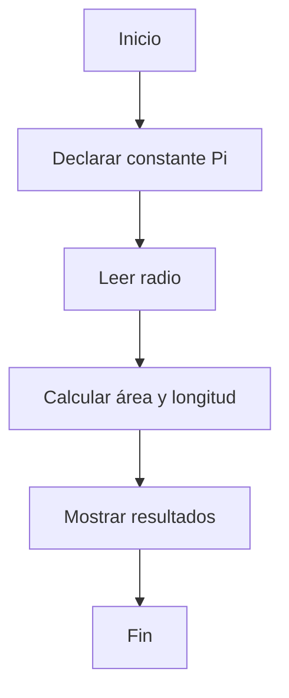
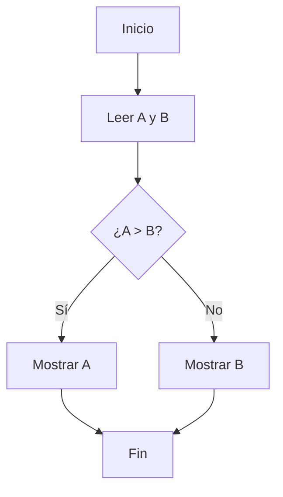
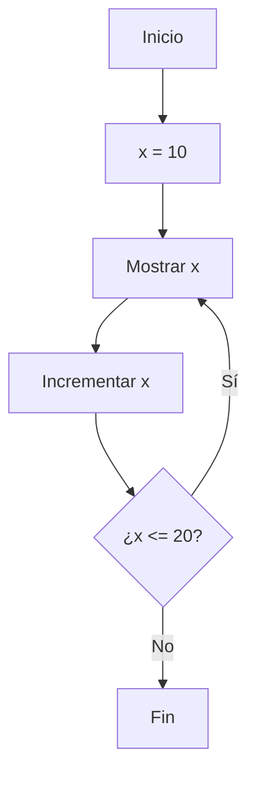

# Algoritmos II

## Estructuras básicas
Cualquier programa se puede resolver utilizando una o varias de las estructuras básicas:
- Secuenciales
- Alternativas
- Repetitivas

## Secuencial
La ejecución tiene un comienzo y un final. Las instrucciones se ejecutan en el mismo orden en el que están escritas.

### Ejemplo (Mermaid)


## Alternativa
Pueden tener una o dos salidas (if...else), varias salidas (switch...case) y pueden contener otras estructuras anidadas.

### Ejemplo simple


## Repetitiva
Ejecuta instrucciones varias veces según una condición. Tipos: Mientras (while), Repite...Hasta (do...while).

### Ejemplo: Mostrar números del 10 al 20


### Pseudocódigo del bucle
```text
Inicio
x = 10
Repite
    Escribir x
    x = x + 1
Hasta que x > 20
Fin
```
